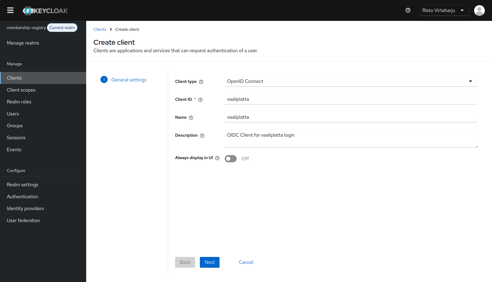
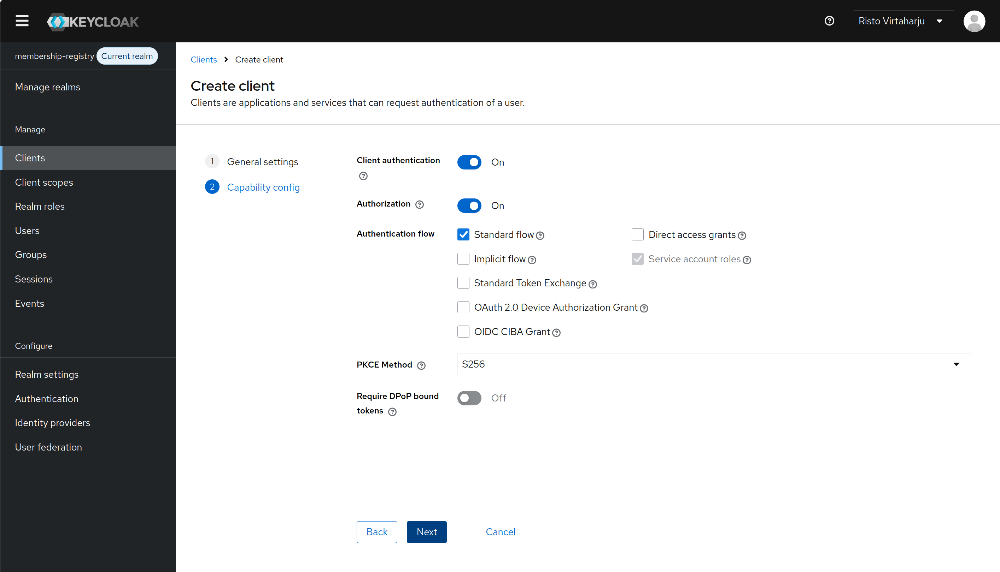
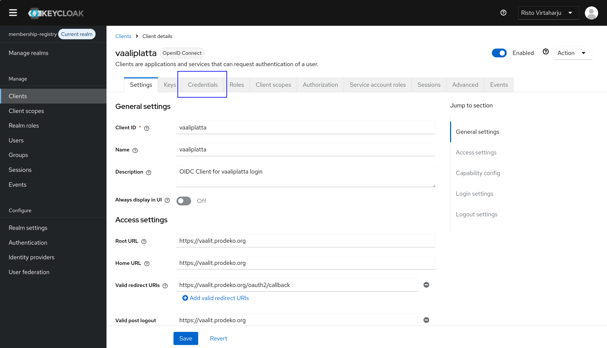
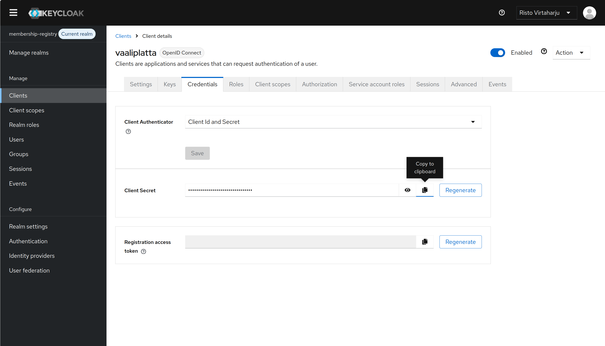

# Adding a new Keycloak client

This walks through registering a new OpenID Connect client in the
`membership-registry` realm so an external application can use Keycloak for
login. The screenshots use a client called `vaaliplatta` as an example —
substitute your own client ID, name, and URLs.

Production clients are configured through the admin panel, not `setup.py`.
The production admin panel can be accessed with mediakeisari- or cto accounts
in [id.prodeko.org/admin](https://id.prodeko.org/admin/master/console/).
See [keycloak/README.md](../keycloak/README.md) for context on the automated
dev-realm setup.

## Prerequisites

- Admin access to the Keycloak instance
- The final public URL of the application (e.g. `https://vaalit.prodeko.org`)
- The OAuth2 callback path your app uses (e.g. `/oauth2/callback`)

## 1. General settings

In the admin console, select the `membership-registry` realm, open
`Clients`, and click `Create client`.

- Client type: `OpenID Connect`
- Client ID: short machine identifier, e.g. `vaaliplatta`
- Name: human-readable label
- Description: what the client is for
- Always display in UI: off

## 2. Capability config

- Client authentication: on (confidential client — the app has a secret)
- Authorization: on
- Authentication flow: `Standard flow` only. Leave `Direct access grants`,
  `Implicit flow`, `Device Authorization Grant`, and `CIBA` unchecked.
  `Service account roles` is enabled automatically when client authentication
  is on.
- PKCE Method: `S256`
- Require DPoP bound tokens: off

Turn on `Direct access grants` only if the app genuinely needs the password
grant (usually it does not). Turn on `Service account roles` usage only if the
app also makes M2M calls — in that case follow the `membership-registry-m2m`
pattern and assign realm-management roles on the `Service account roles` tab
after saving.

## 3. Login settings

Fill in the URLs that match the deployed app:

- Root URL: base URL of the app
- Home URL: same as root (where Keycloak links to from its account console)
- Valid redirect URIs: the OAuth2 callback, e.g.
  `https://vaalit.prodeko.org/oauth2/callback`. Be specific — avoid wildcards
  in production.
- Valid post logout redirect URIs: where Keycloak may redirect after logout
- Web origins: origins allowed to make CORS requests, e.g.
  `https://vaalit.prodeko.org`

Click `Save`.

## 4. Copy the client secret

After saving, the client detail view opens. Go to the `Credentials` tab.

- Client Authenticator: `Client Id and Secret`
- Copy the `Client Secret` with the clipboard icon

Give the application the following values:

- Issuer URL: `https://<keycloak-host>/realms/membership-registry`
- Client ID: the ID from step 1
- Client Secret: from the Credentials tab
- Redirect URI: must exactly match one of the valid redirect URIs above

Treat the client secret like a password — store it in the app's secret
manager, never in source control. Use `Regenerate` if it is ever exposed;
this invalidates the old value immediately.

## Local development

I recommend you bootstrap Keycloak and the membership-registry locally for
local development of SSO-consuming applications. You can create local only
clients using the production Keycloak instance if you know what you are doing.
For a local-only client, use `http://localhost:<port>` for the root, home,
and web origin, and `http://localhost:<port>/oauth2/callback` for the
redirect URI. The issuer is `http://localhost:8180/realms/membership-registry`.
